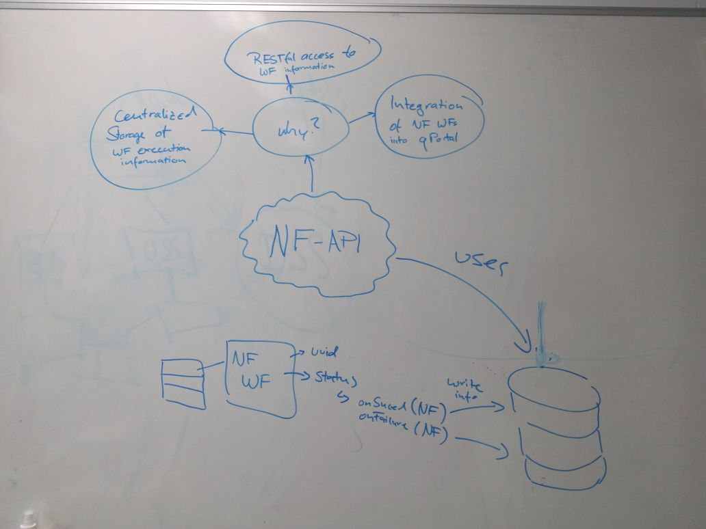

# qbic-nextflow-api
A RESTful API, which enables access to cluster jobs, submitted with Nextflow.

## API planning

- [ ] Make a list of information, that should be accessible over the API
- [ ] Design a basic API specification with [swagger](https://swagger.io/)
- [ ] Create Java Spring stub classes from swagger
- [ ] Implement API with Java Spring Boot
- [ ] Implement database for storing the meta information of a Nextflow workflow
- [ ] Implement information transfer in an example Nextflow script, with database INSERT commands 

## Brainstorming

## Necessary information

### General workflow information
This can be information, which is actually interesting for doing workflow statistics. For example get workflows of a certain type, from a certain userID, workflows that failed, workflows that succeeded and so on.

### Workflow specific information
Specific information can be captured by the Nextflow's [introspection features](https://www.nextflow.io/docs/latest/metadata.html):

* scriptId
* scriptName
* scriptFile
* repository
* commitId
* revision
* projectDir
* launchDir
* workDir
* configFiles
* container
* commandLine
* profile
* runName
* sessionId
* resume
* start

Accessible in the **workflow completion** handler only:
* _complete_
* _duration_

Accessible in the **workflow completion** and **error handlers** only:
* _success_
* _exitStatus_
* _errorMessage_
* _errorReport_

An additional information would be a **userId**, which is a meta information that can come from a third party software, such as a portal runtime environment.

This information can be provided in a **metadata.yaml** file, which gets parsed in the beginning of the pipeline execution and grabs user information.

